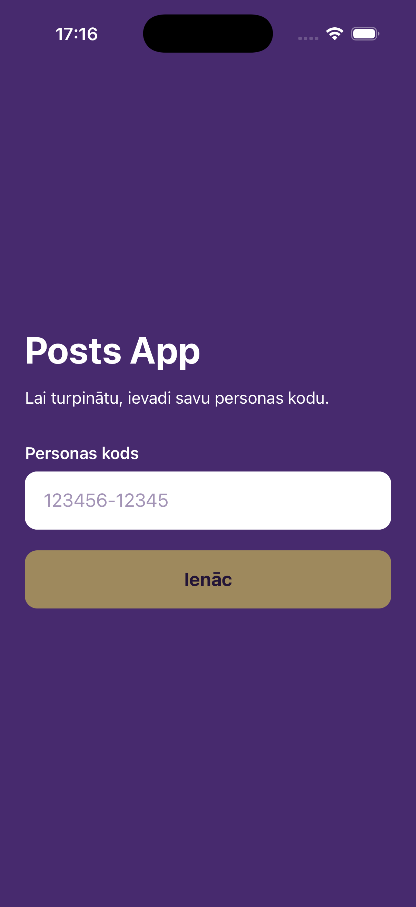
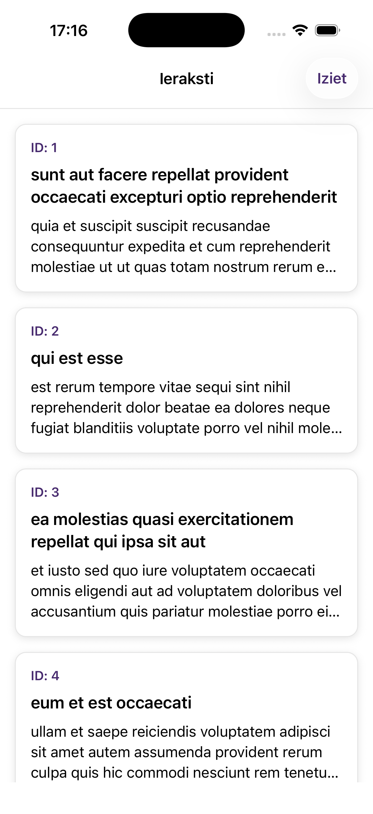
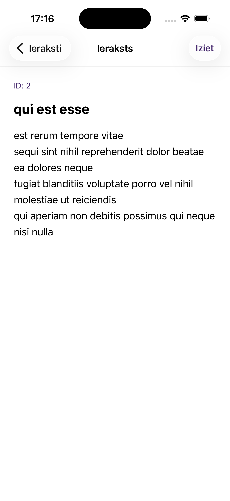

# Posts App

A small React Native application built with Expo.

The app includes:

- Person code validation and a simple authentication flow
- Valid person code for testing the flow: 120392-13811
- Persisted authentication session using AsyncStorage
- Paginated posts fetched from JSONPlaceholder
- Post details screen
- Loading, error, and empty states
- Logout functionality
- Tests for session persistence and API-related functionality

## Tech Stack

- React Native
- Expo
- Expo Router
- TypeScript
- AsyncStorage
- Jest

## Running the project

```bash
npm install
npm start
```

## Running tests

```bash
npm test
```

## API

Posts are fetched from [JSONPlaceholder](https://jsonplaceholder.typicode.com/posts).

## Screenshots

<p align="center">
  
  
  
</p>
